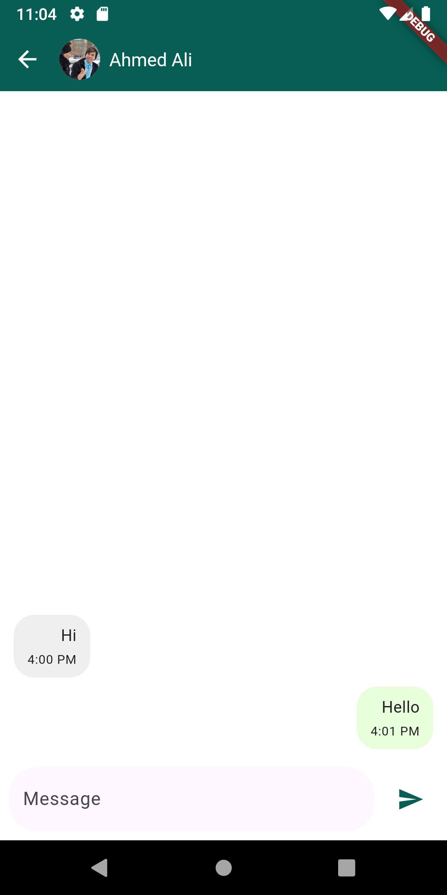

# WhatsApp UI Clone (Flutter)

## Summary
A WhatsApp-style UI built with Flutter. Goal: reproduce core screens with high fidelity using local mock data to demonstrate user flow.

## Implemented Screens
- **Chat List:** name, last message, time, and unread badge.
- **Chat:** sent and received bubbles with timestamps, input field, and send action.
- **Stories:** contacts list with a story count per contact.
- **Story Viewer:** full-screen image with a top progress indicator.

## Tech
- Flutter and Dart.
- Local mock data under `assets`.
- Responsive layouts for multiple screen sizes.
- Light and dark themes.

## Run Locally
1. Install Flutter (stable channel).
2. From the project root:
   ```bash
   flutter pub get
   flutter run
   ```

## Screenshots





---

**Notes**  
- Images are for README illustration only.  
- Mock data can be replaced with a real backend or Firebase later.
